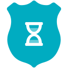

<h1 align="center">
  Time Cop
   
  
</h1>

  A time tracking app that respects your privacy and gets the job done without getting too fancy.

 

  

## Motivation

I'd rather not do time-tracking at all, but since its a necessity for my work, it's either use an app or keep track of things manually (which I'm terrible at). There are many time tracking apps on the app stores (and I have tried several of them), but each of them has at least one pain point that eventually drives me off—some cost more money than I think they should, others have (what I consider) poorly designed interfaces, some are way too complicated, some don't export data easily, most require an internet connection, I have privacy concerns with a large number of them, etc, etc.

Time tracking in and of itself is rather straightforward (hence all the apps on the app stores), so I figured “why not use this as an opportunity to practice mobile development and learn some new things?”. This app is the result of that question—its a tool that I use every day for work, but also a sample project to work off of and share with others.

## Features

* Offline-only, mobile-only (iOS / Android)
* Fully private—there is no tracking / spying / advertising / etc
* Keep track of tasks with multiple parallel timers that can be started with the tap of a button
* Associate timers with projects to group your work (or don't)
* Start, stop, edit, and delete timers whenever with no fuss
* Export data as a `.csv` file, filtered by timespans and projects
* Export the app's database for full access to all of its data
* Automatic light mode / dark mode based on your device settings
* Localized in several languages (thanks to [Google Translate](https://cloud.google.com/translate)): English, Arabic, German, Spanish, French, Hindi, Indonesian, Japanese, Korean, Portuguese, Russian, Chinese (Simplified), Chinese (Traditional)
* Open source ([licensed under Apache-2.0](LICENSE))—fork away!

## Screenshots

        

More screenshots (including dark-mode and localization demonstrations) are available in the [screenshots/](screenshots/) folder.

## Contributing

I'm happy to take bug reports and pull requests if you want to help improve _Time Cop_, but I fundamentally want to keep this app relatively small and simple. If that's not for you, there's [plenty](https://toggl.com/) of [other](https://clockify.me/) [options](https://www.workpuls.com/) [out](https://www.manictime.com/) [there](https://trackabi.com/).

The app is created pretty much entirely in [Dart](https://dart.dev/) using [Flutter](https://flutter.dev/), and I tried to make heavy use of the [Bloc](https://bloclibrary.dev/#/) pattern.

Here are a few resources to get you started if this is your first Flutter project:

- [Lab: Write your first Flutter app](https://flutter.dev/docs/get-started/codelab)
- [Cookbook: Useful Flutter samples](https://flutter.dev/docs/cookbook)

For help getting started with Flutter, view its [online documentation](https://flutter.dev/docs), which offers tutorials,
samples, guidance on mobile development, and a full API reference.

### Localizations

Translations are handled using [Project Fluent](https://projectfluent.org/). Currently all translations (except English) were auto-translated by [Google Translate](https://cloud.google.com/translate) using my [Translate Tool](https://github.com/hamaluik/translatetool). If you notice any incorrect strings, I would love to know about it so that it can be fixed asap. Similarly, if you want to add a language, please do!

## Todo

A list of “user stories” (and I use that term very loosely) guiding the development of this app is available in [design/user-stories.md](design/user-stories.md); any unchecked boxes are outstanding items on the todo list!
